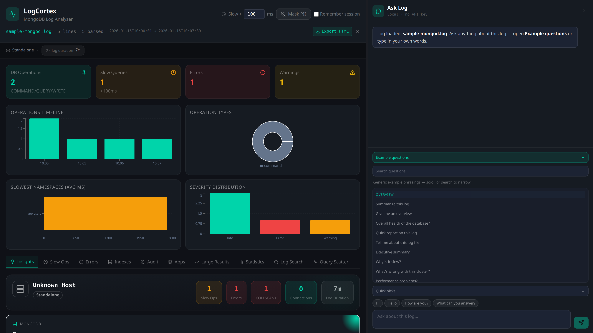
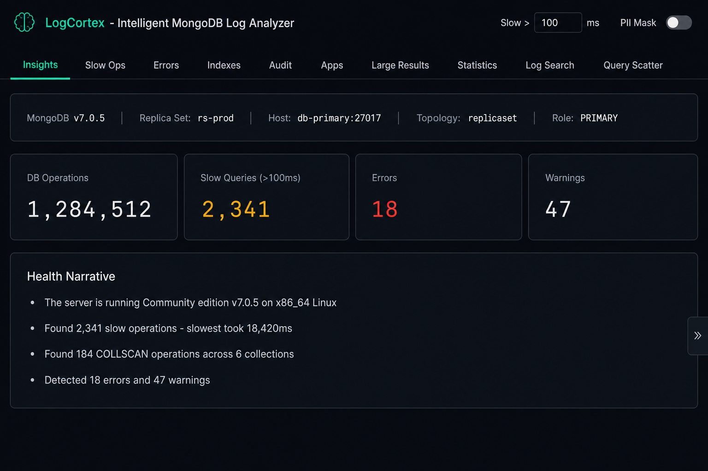
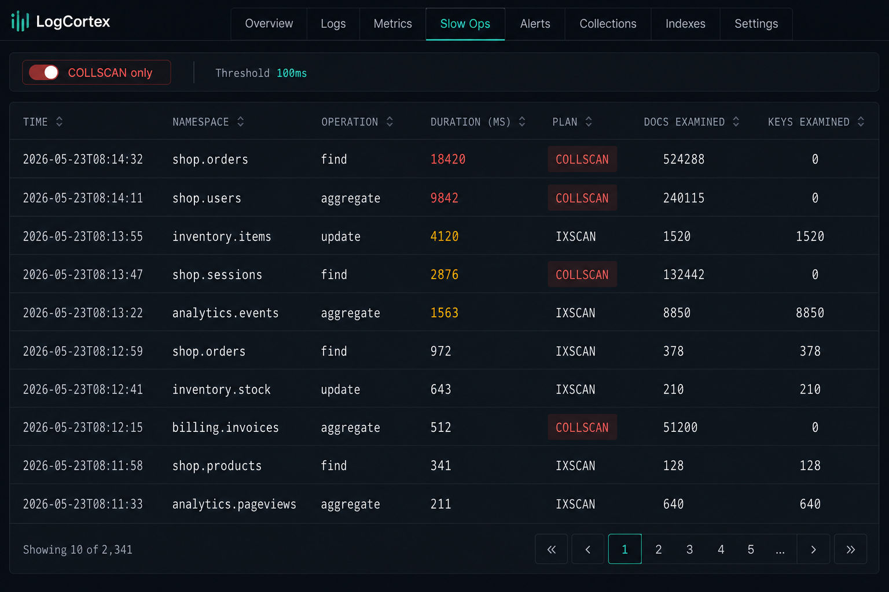
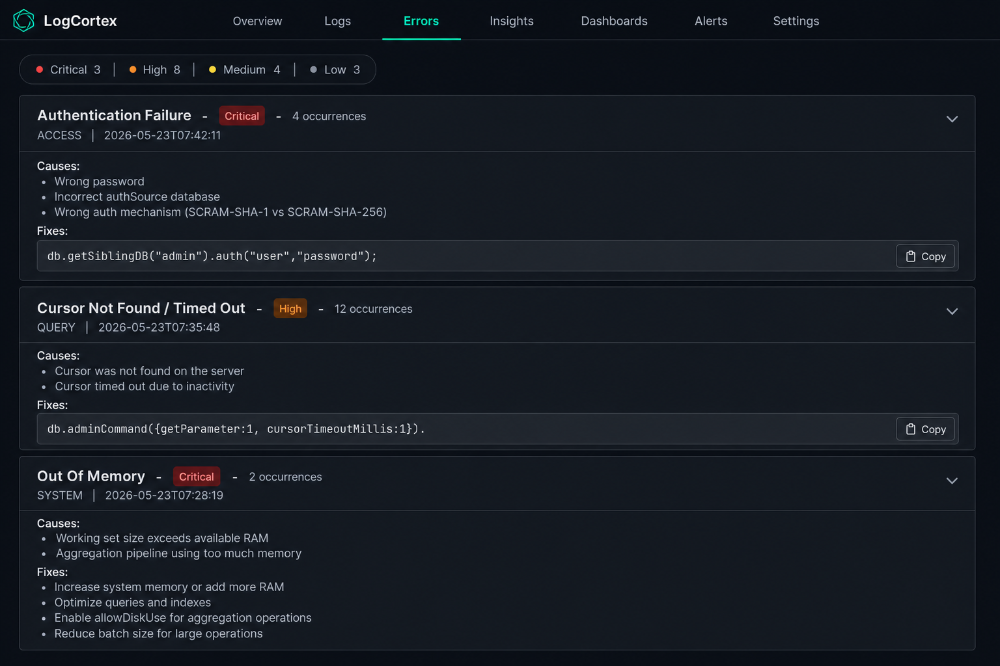
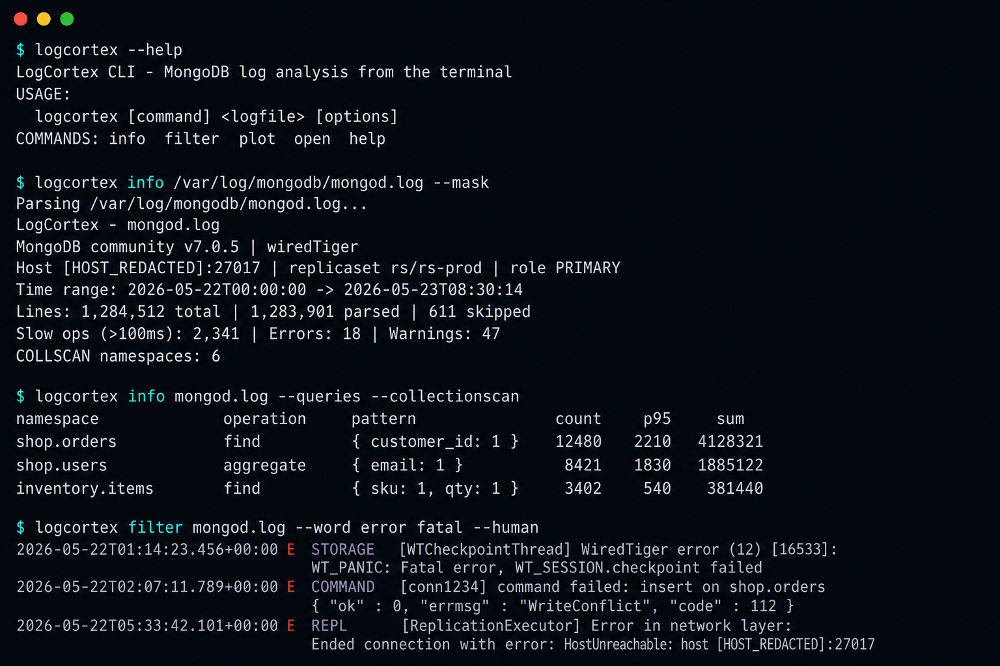
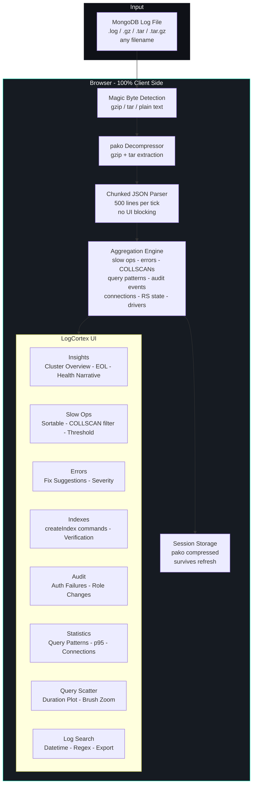
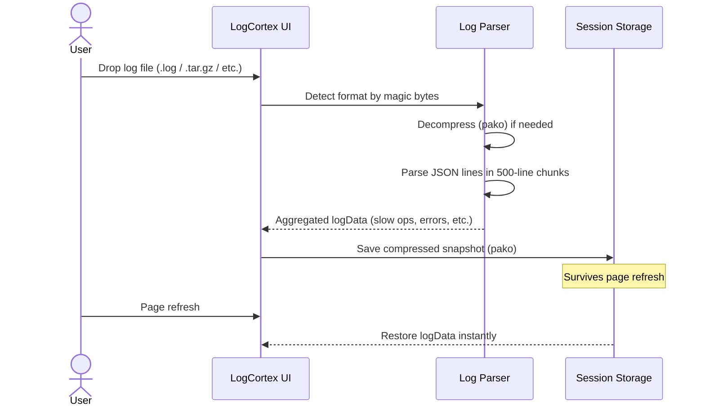

# LogCortex — MongoDB Log Analyzer

> A free, browser-based MongoDB log analysis tool with security auditing, performance visualization, and index recommendations. Web UI **and** CLI emit structured JSON for scripts and external tooling. **No backend. Data stays in your browser.**

## What is LogCortex?

LogCortex is a MongoDB log analysis platform that runs entirely in your browser, with a matching CLI for SSH/CI use. Drop in a MongoDB log file and instantly get:

- Performance analysis of slow queries with index recommendations
- Security auditing of authentication failures and unauthorized access
- Interactive charts and scatter plots for operation durations
- Cluster topology, MongoDB EOL status, and driver compatibility checks
- Structured output — `--json` from the CLI and HTML reports from the UI for automation or follow-up analysis elsewhere
- Fully local execution with no cloud dependency

---

## Screenshots

> Sample views from the LogCortex web UI and command line. Replace these images with captures from your own logs at any time.

### Ask Log — local Q&A panel



The **Ask Log** panel on the right answers questions about your loaded log in the browser — version, slow queries, COLLSCAN, errors, security, connections, and more. Open **Example questions** for generic phrasings to click, or type your own; no API key and no cloud. See [docs/ASK_LOG_QUESTIONS.md](docs/ASK_LOG_QUESTIONS.md) for the full list.

### Insights — overview after upload



The **Insights** tab summarizes the parsed log: MongoDB version, topology, primary/secondary role, time range, and headline counts (operations, slow queries, errors, warnings) with an auto-generated health narrative.

### Slow Ops — sortable table with COLLSCAN highlighting



The **Slow Ops** tab lists slow queries with namespace, operation, duration, plan, and docs/keys examined. Toggle COLLSCAN-only to find missing indexes fast.

### Errors — pattern-matched fix suggestions



The **Errors** tab groups recurring error patterns (auth failures, cursor timeouts, OOM, write conflicts, ...) with severity, causes, and copy-ready fix commands.

### Command line — same engine, terminal output



The CLI mirrors the web UI for SSH/CI use. Common commands and what they answer:

| Question | Command |
|----------|---------|
| Show me a summary | `logcortex info mongod.log` |
| What MongoDB version is this? | `logcortex info mongod.log` (top of summary) |
| Show me the errors | `logcortex info mongod.log --errors` |
| Show slowest queries | `logcortex info mongod.log --slow` |
| Find missing indexes | `logcortex info mongod.log --queries --collectionscan` |
| Tail just `error` / `fatal` lines | `logcortex filter mongod.log --word error fatal --human` |
| Mask PII before sharing output | add `--mask` to any command |

---

## Table of Contents

- [Quick Start](#quick-start)
  - [Command line](#command-line-mtools-style)
- [Features](#features)
- [Usage](#usage)
- [Troubleshooting](#troubleshooting)
- [Architecture](#architecture)
- [How It Works](#how-it-works)
- [Configuration](#configuration)
- [Supported Log Formats](#supported-log-formats)
- [Privacy and Security](#privacy-and-security)
- [FAQ](#faq)
- [Tech Stack](#tech-stack)
- [Project Structure](#project-structure)
- [Contributing](#contributing)
- [License](#license)

---

## Quick Start

### Prerequisites

- [Node.js](https://nodejs.org/) **18 LTS or newer** (20 LTS recommended for development)

Verify Node.js:

```bash
node -v   # expect v18.x or v20.x
```

`npm install` is tested on Node 18 and 20. If you see `EBADENGINE` warnings, your Node version may be older than a dev tool expects — upgrade Node or continue (install usually still succeeds).

### Install and Run

Works on **macOS, Windows 10/11, and Linux**.

```bash
# 1) Clone your repository URL from GitHub
git clone <repository-url>
cd <repository-folder>

# 2) Install dependencies
npm install

# 3) Start the dev server
npm run dev
```

Open `http://localhost:5173` in your browser.

### Command line (mtools-style)

LogCortex ships a terminal CLI for SSH, CI, and scripts. It uses the same parsing engine as the web UI and supports the same PII masking. Modeled after [mtools](https://rueckstiess.github.io/mtools/) (`mloginfo`, `mlogfilter`, `mplotqueries`).

#### Install

```bash
npm install
```

Run the CLI directly from the repo (no global install needed):

```bash
npm run cli -- --help
npm run cli -- info mongod.log
```

Optional global `logcortex` command — **without `sudo`**:

```bash
mkdir -p ~/.local
npm config set prefix "$HOME/.local"
echo 'export PATH="$HOME/.local/bin:$PATH"' >> ~/.bashrc
source ~/.bashrc
npm link
logcortex --help
```

> If `npm link` reports `EACCES: permission denied`, do **not** use `sudo`. Set the user prefix as above and try again, or stick with `npm run cli -- …`.

#### Command reference

| Command | What it does | mtools equivalent |
|---------|--------------|-------------------|
| `logcortex info <log>` | Summary: version, host, time range, totals | `mloginfo` |
| `logcortex info <log> --queries` | Query patterns (count, min/max/p95/sum) | `mloginfo --queries` |
| `logcortex info <log> --queries --collectionscan` | COLLSCAN namespaces only | `mloginfo --queries --collectionscan` |
| `logcortex info <log> --slow` | Slow ops table | — |
| `logcortex info <log> --errors` | Errors and warnings | — |
| `logcortex info <log> --audit` | Security audit summary | — |
| `logcortex filter <log> --word error fatal` | Match lines by keywords | `mlogfilter --word` |
| `logcortex filter <log> --slow --human` | Human-readable slow lines | `mlogfilter --slow --human` |
| `logcortex filter <log> --severity E --component COMMAND` | Filter by severity / component | `mlogfilter` |
| `logcortex filter <log> --from 2026-05-22 --to 2026-05-23` | Time range filter | `mlogfilter --from` |
| `logcortex plot <log> --type range --gap 600` | Time-bucket plot data | `mplotqueries --type range` |
| `logcortex plot <log> --type scatter --limit 30` | Scatter outlier summary | `mplotqueries --type scatter` |
| `logcortex --file <log> --mask` | Any command with PII masking | — |
| `logcortex --help` | Full options reference | `mloginfo --help` |

#### Common flags

| Flag | Meaning |
|------|---------|
| `--file` / `-f` | Log file path (or pass it as last argument) |
| `--mask` / `--masking=true` | Redact PII (IPs, emails, conn strings, query values) |
| `--mask-ns` / `--mask-ip` / `--mask-host` | Finer-grained masking |
| `--slow-threshold <ms>` | Slow query threshold (default `100`) |
| `--out <file>` / `-o` | Write output to a file (filter command) |
| `--json` | Machine-readable JSON output |
| `--limit <n>` | Cap rows / points (default 50) |

#### Examples

```bash
# Quick summary
logcortex /var/log/mongodb/mongod.log

# Same with PII redacted (safe to share)
logcortex info /var/log/mongodb/mongod.log --mask

# Find missing indexes
logcortex info mongod.log --queries --collectionscan --mask

# Tail just the errors and fatals, human-readable
logcortex filter mongod.log --word error fatal --human

# Save filtered slow ops for sharing
logcortex filter mongod.log --slow --out slow.jsonl --mask

# Pipe JSON into jq / dashboards
logcortex info mongod.log --queries --json | jq '.queries[0:3]'

# Time-bucketed view (mplotqueries-style)
logcortex plot mongod.log --type range --group operation --gap 600
```

Aliases also work: `logcortex mloginfo …`, `logcortex mlogfilter …`, `logcortex mplotqueries …`.

### Build for Production

```bash
npm run build
npx serve dist
```

---

## Features

| Category | Feature |
|---|---|
| **Parsing** | MongoDB JSON log v4.4+, `.log`, `.json`, `.gz`, `.zip`, `.tar`, `.tar.gz`, `.tgz`, any extension with magic-byte detection |
| **Insights** | Auto-generated health narrative, MongoDB EOL status, driver compatibility, per-IP stats, long-lasting connections |
| **Slow Ops** | Sortable table with total ms, reslen, COLLSCAN toggle, configurable threshold, click-to-expand full command |
| **Errors** | Fix suggestions for common error patterns (auth failures, write conflicts, cursor timeouts, OOM, and more) |
| **Indexes** | COLLSCAN detection by namespace, auto-generated `createIndex()` commands with verification steps |
| **Audit** | Authentication failures, unauthorized access, user/role changes, SSL/TLS events with severity ratings |
| **Apps** | Per-application breakdown by `appName` with slow ops, errors, and p95 latency |
| **Large Results** | Detects operations with response size over 16 MB, including missing projection analysis |
| **Statistics** | Overview, queries (p95/sum), connections, restarts, RS state, distinct messages, WiredTiger stats |
| **Log Search** | Datetime range, severity/component filters, regex search, and filtered log download |
| **Query Scatter** | Scatter plot of slow ops (x=time, y=duration), brush zoom, threshold lines, op-type toggles |
| **PII Masking** | Obfuscation of IPs, emails, hostnames, query values, SSN, and credit card patterns |
| **Server Info Bar** | Hostname, port, topology, PRIMARY/SECONDARY role, RS members, MongoDB version, uptime |
| **Export** | One-click HTML report, downloadable filtered logs, copy-to-clipboard code blocks |
| **Session Persistence** | Compressed session storage keeps logs loaded after refresh |
| **CLI** | Terminal analysis: `info`, `filter`, `plot` with PII masking (`--mask`) |

---

## Usage

1. Drop a MongoDB log file into the upload zone (`.log`, `.json`, `.gz`, `.zip`, `.tar`, `.tar.gz`, `.tgz`).
2. LogCortex parses it in-browser using chunked processing to keep the UI responsive.
3. Explore tabs:
   - **Insights** for cluster overview and health narrative
   - **Slow Ops** for latency sorting and COLLSCAN filtering
   - **Indexes** for index command suggestions
   - **Errors** for pattern-based fix suggestions
   - **Statistics** for query and connection behavior
   - **Query Scatter** for time-vs-duration outliers

---

## Troubleshooting

### App Does Not Start

- Confirm Node version is 18+ using `node -v`.
- Remove and reinstall dependencies:

```bash
rm -rf node_modules package-lock.json
npm install
npm run dev
```

### Very Large Log Files Feel Slow

- Use a Chromium-based browser with enough free memory.
- Disable other heavy tabs/apps while parsing.
- Start with compressed `.gz` files when possible.

### File Does Not Parse

- Confirm it is MongoDB structured JSON log format (v4.4+).
- Archives must contain at least one readable MongoDB log file.

### `logcortex: command not found`

The CLI works without a global install:

```bash
npm run cli -- --help
npm run cli -- info mongod.log
```

To install a global `logcortex` command, use a **user-local** npm prefix (do not use `sudo npm link`):

```bash
mkdir -p ~/.local
npm config set prefix "$HOME/.local"
echo 'export PATH="$HOME/.local/bin:$PATH"' >> ~/.bashrc
source ~/.bashrc
npm link
logcortex --help
```

### `npm link` — permission denied (EACCES)

npm tried to write to `/usr/local/lib/node_modules`. Fix by setting prefix to your home directory (see above), or skip linking and use `npm run cli -- …` instead.

### `npm WARN EBADENGINE` on install

Harmless on many setups: dependencies still install. For a clean install on Node 18, use the versions pinned in this repo (`package-lock.json`). Prefer **Node 20 LTS** if you upgrade tooling later.

---

## Architecture



## How It Works



---

## Configuration

### Web UI

| Setting | Where | Default |
|---|---|---|
| Slow op threshold | Header input field | 100ms |
| PII masking | Shield button in header | Off |
| Mask namespace names | Checkbox (when PII is on) | Off |

### CLI

| Flag | Description |
|---|---|
| `--file` / `-f` | Log file path |
| `--mask` / `--masking=true` | Redact PII in CLI output |
| `--mask-ns` / `--mask-ip` / `--mask-host` | Finer-grained masking |
| `--slow-threshold` | Slow query threshold in ms (default `100`) |
| `--json` | Machine-readable output |
| `info --queries` | Query pattern table (mloginfo-style) |
| `filter --word …` | Filter log lines (mlogfilter-style) |
| `plot --type range --gap 600` | Time buckets (mplotqueries-style) |

---

## Supported Log Formats

| Format | Extension | Notes |
|---|---|---|
| MongoDB JSON log | `.log`, `.json`, `.logs` | Structured JSON format (v4.4+) |
| Gzip compressed | `.gz`, `.log.gz`, `.json.gz` | Auto-decompressed (native streaming where supported) |
| Zip archive | `.zip` | Picks the best inner log file automatically |
| Tar archive | `.tar` | Extracts MongoDB log from archive |
| Gzipped tar | `.tar.gz`, `.tgz` | Decompresses and extracts |
| MongoDB Atlas export | any | Detected by magic bytes, not extension |
| Any filename | any | File type detected from binary content |

---

## Privacy and Security

- **Logs stay local**: parsing and analysis happen in-browser in memory.
- **PII masking**: obfuscates sensitive fields before display.
- **Compressed session storage**: preserves state across refresh within the same browser.

---

## FAQ

### Does Any Data Leave My Machine?

No. LogCortex runs entirely client-side. Log files are parsed in your browser and are not uploaded to any server.

### Can I Use LogCortex From the Terminal?

Yes. Run `npm run cli -- info your.log` from the project directory, or `npm link` with a user-local npm prefix for a global `logcortex` command. See [Command line](#command-line-mtools-style).

### Is There a Maximum File Size?

Yes. Browser parsing supports files up to **5 GB**. The parser streams the file rather than loading it all at once, so memory usage stays low (~150–300 MB peak) regardless of file size.

For files larger than 5 GB, extract a smaller time range first using `grep` or `mongodump` and upload that subset.

> Note: gzip (`.gz`) files use native streaming decompression in modern browsers (Chrome, Edge, Firefox 113+, Safari 16.4+); older browsers fall back to in-memory decompression. ZIP and tar archives currently buffer the archive into memory before extraction.

---

## Tech Stack

| Library | Purpose |
|---|---|
| [React 18](https://react.dev/) | UI framework |
| [Vite 6](https://vite.dev/) | Build tool |
| [Recharts](https://recharts.org/) | Charts (bar, pie, scatter) |
| [Lucide React](https://lucide.dev/) | Icons |
| [pako](https://github.com/nodeca/pako) | Gzip/tar decompression in browser |
| [Tailwind CSS](https://tailwindcss.com/) | Styling |

**No backend. No database. No external APIs.**

---

## Project Structure

```text
logcortex/
├── bin/
│   └── logcortex.js               # CLI entry (npm run cli / npm link)
├── src/
│   ├── cli/                       # Terminal commands (info, filter, plot)
│   ├── LogCortex.jsx              # Main app component
│   ├── main.jsx                   # React entry point
│   ├── components/
│   │   ├── tabs/
│   │   │   ├── InsightsTab.jsx    # Cluster overview + health narrative
│   │   │   ├── SlowOpsTab.jsx     # Slow operations table
│   │   │   ├── ErrorsTab.jsx      # Errors with fix suggestions
│   │   │   ├── IndexesTab.jsx     # COLLSCAN + index recommendations
│   │   │   ├── AuditTab.jsx       # Security audit
│   │   │   ├── AppNamesTab.jsx    # Per-application analysis
│   │   │   ├── ReslenTab.jsx      # Large result detection
│   │   │   ├── StatisticsTab.jsx  # Deep query statistics
│   │   │   ├── LogSearchTab.jsx   # Log filter + search
│   │   │   └── QueryScatterTab.jsx# Scatter plot visualization
│   │   ├── ui/
│   │   │   ├── ClusterOverview.jsx
│   │   │   ├── ServerInfoBar.jsx
│   │   │   ├── CopyBtn.jsx
│   │   │   ├── ExportBtn.jsx
│   │   │   └── SortTh.jsx
│   │   └── charts/
│   │       ├── ChartTip.jsx
│   │       └── ScatterTip.jsx
│   └── utils/
│       ├── parseLogFile.js        # Core log parser + all aggregations
│       ├── tarParser.js           # Browser-side TAR extraction
│       ├── statisticsText.js      # Statistics text formatters
│       ├── pii.js                 # PII masking + obfuscation
│       ├── queryUtils.js          # Query normalization + sorting
│       └── constants.js           # Colors + severity labels
├── scripts/
│   └── check-branding.sh          # Optional pre-commit branding check
├── .githooks/
│   └── pre-commit
└── package.json
```

---

## Contributing

Contributions are welcome. Open an issue first to discuss the proposed change.

Enable the optional pre-commit branding check:

```bash
git config core.hooksPath .githooks
```

---

## License

[MIT](./LICENSE) - see `LICENSE` for full text.

---

## Maintainers

Maintained by the LogCortex contributors. If LogCortex helped you debug a slow query at 2 AM, consider giving the repo a star.
